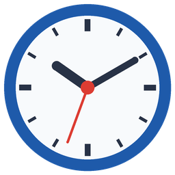
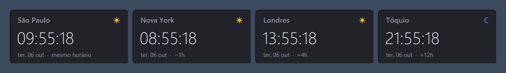
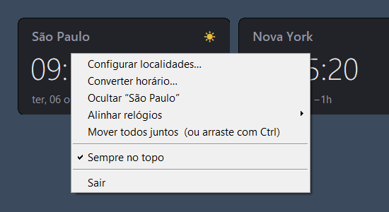
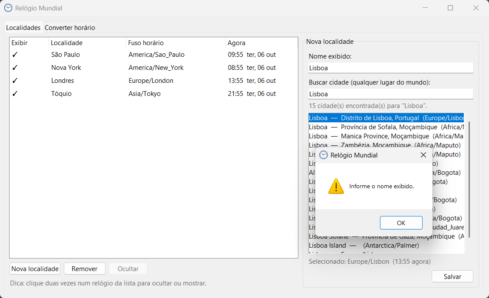
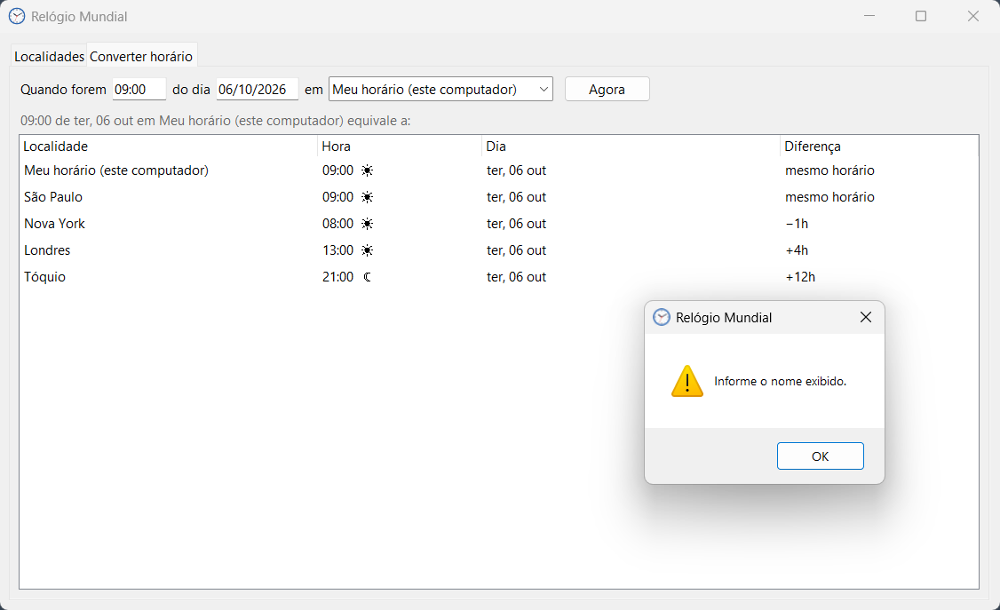

# Relógio Mundial

O projeto consiste em relógios de fusos diferentes direto na área de trabalho do Windows. Cada cidade vira um widget pequeno, que você arrasta pra onde quiser. Ele mostra a hora local, a diferença em relação ao seu fuso e se lá é dia (☀) ou noite (☾).

É um único `.exe`. O Python já roda dentro do executável, por isso não tem instalador.

## Baixar e abrir

Baixe o executável: [**Relógio Mundial.exe**](https://github.com/eliezerberag/worldclock/raw/main/dist/Rel%C3%B3gio%20Mundial.exe)

Coloque ele numa pasta só dele, por exemplo `Documentos\Relógio Mundial`. O `config.json` será criado na mesma pasta. Na primeira vez pode demorar alguns segundos pra abrir.

Quando abre, já vêm quatro cidades: São Paulo, Nova York, Londres e Tóquio. Troque pelas que você usa.

> **Windows reclamando?** O `.exe` não tem assinatura digital. Se aparecer “O Windows protegeu o computador”, clique em **Mais informações → Executar assim mesmo**. É possível que seu antivírus bloqueie a execução pela falta de assinatura, nesse caso você precisará definir uma exceção.

## Usando

**Pra mover:** clica e arrasta. Se segurar **Ctrl** enquanto arrasta, move todos juntos.

**Menu:** clique com o botão direito em qualquer relógio.

O menu tem:

- **Configurar localidades…** — adiciona, edita, oculta ou remove cidades.
- **Converter horário…** — mostra que horas ficam em cada cidade num horário escolhido.
- **Ocultar “nome da cidade”** — esconde o relógio sem apagar.
- **Alinhar relógios** — organiza tudo em coluna ou linha.
- **Mover todos juntos** — todos se movem juntos quando você arrasta.
- **Sempre no topo** — deixa os relógios acima das outras janelas.
- **Sair** — fecha o programa.

### Adicionar cidade

1. Botão direito em um relógio → **Configurar localidades…**
2. Clique em **Nova localidade**.
3. Em **Buscar cidade**, digite o nome. A busca online usa o [Open-Meteo](https://open-meteo.com/). Sem internet, aparece só a lista de fusos que já vem no programa.
4. Escolha a cidade, mude o **Nome exibido** se quiser e clique em **Salvar**.

Pra editar, seleciona a cidade na lista. Pra ocultar ou mostrar de novo, clique duas vezes nela.

### Converter horário

Na aba **Converter horário**, digite a hora (`14:30` ou `14h30`), a data (`25/12` ou `25/12/2026`) e o fuso de origem. Ele mostra o horário equivalente em todas as suas cidades. O botão **Agora** volta pro horário atual.

## Abrir junto com o Windows

Não coloquei isso automático por conta da falta de assinatura. Antivírus costumam encher o saco com programas sem certificado que tentam entrar de forma autônoma na inicialização. Se quiser, dá pra fazer manualmente:

1. Aperta **Win + R**, digita `shell:startup` e dá Enter.
2. Nessa pasta, cria um atalho pro `Relógio Mundial.exe`. O jeito mais fácil é arrastar o arquivo pra lá segurando **Alt**.

Pra desativar, é só apagar o atalho.

## Configurações

Tudo fica no `config.json`, na mesma pasta do `.exe`: cidades, posições e opções. Pra levar suas configs pra outro computador, copie o `.exe` e o `config.json` juntos. Pra voltar ao padrão, apague o `config.json`.

